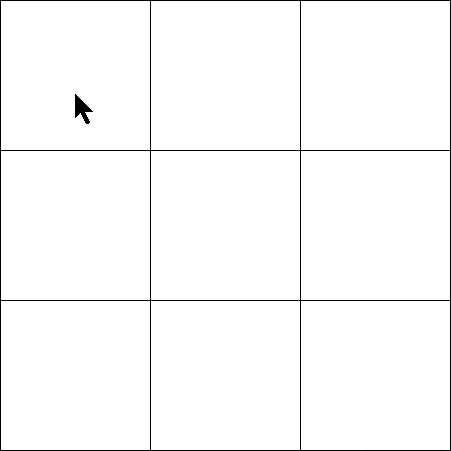
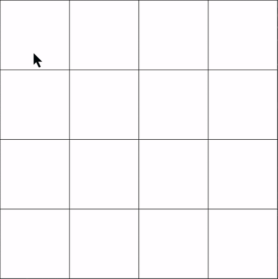

# TicTacToe-Unbeatable-AI
A simple TicTacToe game against the computer coded in Java. The computer has both basic skills and unbeatable skills. No in between.

Instructions:
* Press the 'r' key to restart the game whenever.
* You are X, the AI is O. You start.

___

The following algorithms are used by the AI:
* For easy mode: *__Random Selection__*
* For impossible mode: *__[MiniMax Algorithm](https://en.wikipedia.org/wiki/Minimax) with optional [Alpha-Beta pruning](https://en.wikipedia.org/wiki/Alpha%E2%80%93beta_pruning)__*
  
  * The algorithm does not surpass a maximum defined depth to not take too long. For a 3x3 TicTacToe game it goes to maximum depth. For a 4x4 TicTacToe game it goes to a maximum tree depth of 5. For a 7x7 game, the maximum tree depth is 1.
  * The static evalution for nodes at the end of the branches is simply this:
    ```java
        private static int finalNodeEval(boolean max) {
            if (max)
                return -1;

            return 1;
	    }
    ```
For additional resources on these algorithms. Check out [this video](https://www.youtube.com/watch?v=l-hh51ncgDI). It's amazing!

___

Result looks like this:

3x3:



4x4:

 
